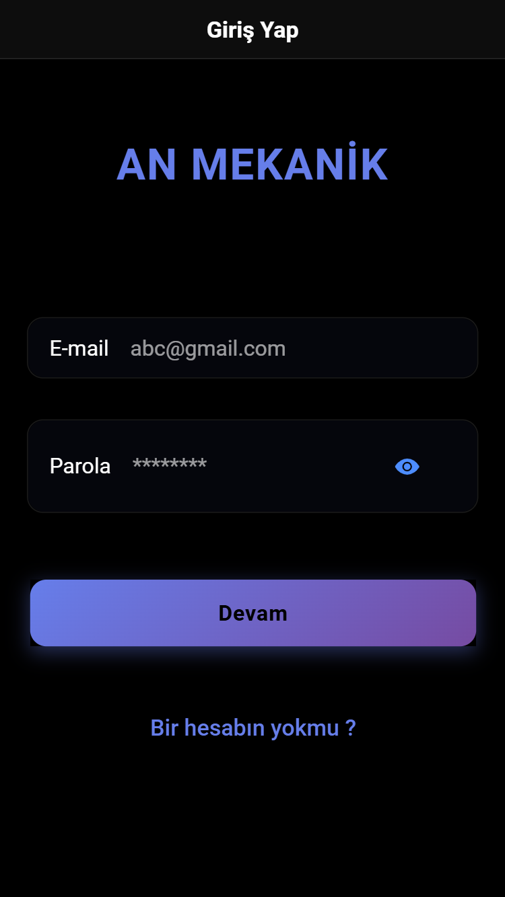
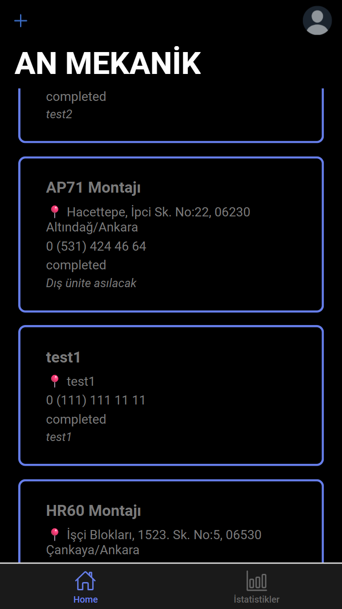
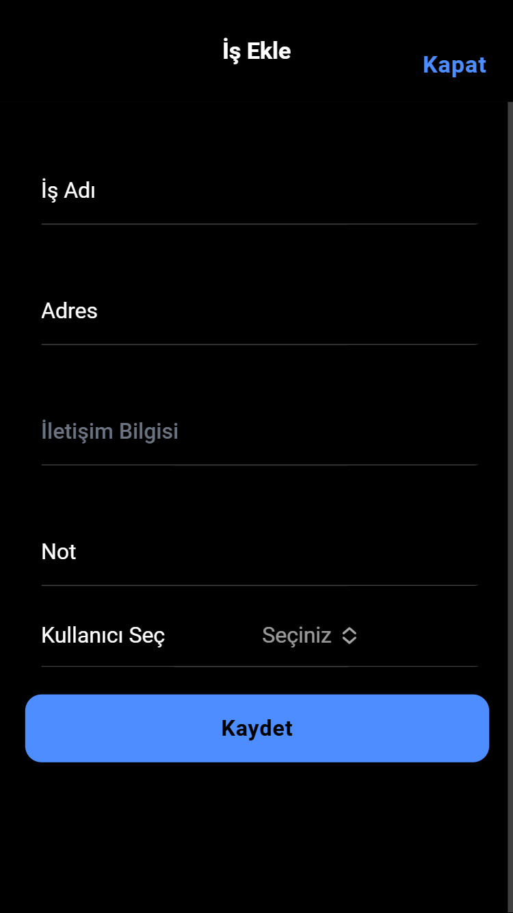
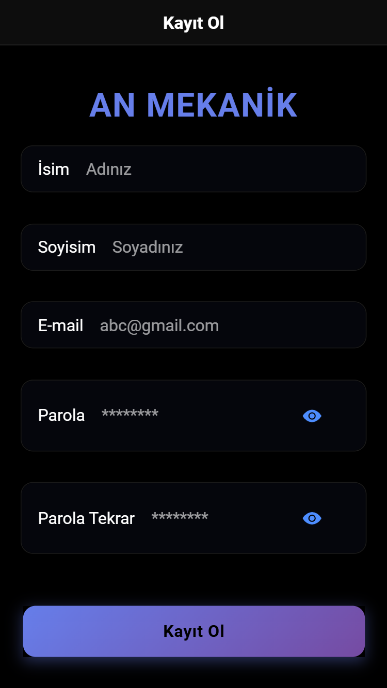
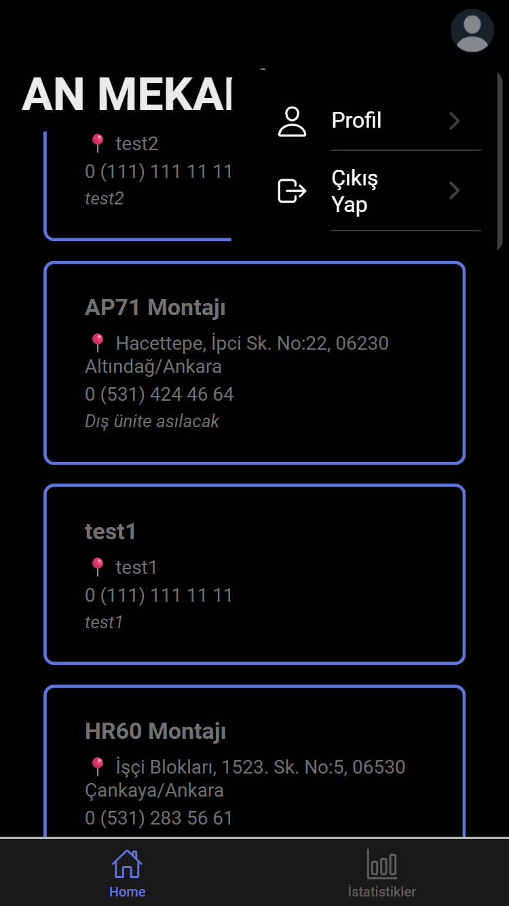

## anTek - Job Tracking App

Modern bir iş takip uygulaması. Yöneticilerin günlük işleri ekleyip yönetebildiği, çalışanların ise güncel işleri takip edebildiği bir sistem.

---

<h2 align="center">Uygulama Görselleri</h2>

<p align="center">
  
  
  
  <br>
  
  
</p>

---

## Kullanılan Teknolojiler

* Ionic Framework
* Angular
* Firebase (Authentication & Firestore)

---

## Özellikler

*  Kullanıcı kayıt & giriş sistemi
*  İş ekleme / düzenleme / silme
*  İş durumu takibi (örn: başvuru yapıldı, görüşme vs.)
*  Yetkilendirme (Auth Guard)

---

## Kurulum

Projeyi klonla:

```bash
git clone https://github.com/kullaniciadi/anTek.git
cd anTek
```

Bağımlılıkları yükle:

```bash
npm install
```

Projeyi çalıştır:

```bash
ionic serve
```

---

## Ortam Değişkenleri

Firebase config bilgilerini `environment.ts` dosyasına eklemelisin:

```ts
export const environment = {
  firebase: {
    apiKey: "YOUR_KEY",
    authDomain: "",
    projectId: "",
    ...
  }
};
```

---

## Notlar

* Firebase güvenlik kurallarını doğru yapılandırmayı unutma
* API key bilgilerini public paylaşmamaya dikkat et

---

## Geliştirici

* Emin (GitHub: MaverW)

---

## Katkı

Projeyi beğendiysen bırakmayı unutma!
